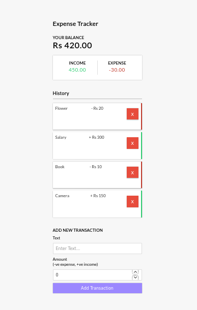

[](https://github.com/nightwarriorftw/expense_tracker/issues) [](https://github.com/nightwarriorftw/expense_tracker/network/members) [](https://github.com/nightwarriorftw/expense_tracker/stargazers)  [](http://ForTheBadge.com)   [](https://twitter.com/intent/follow?screen_name=nightwarriorftw) [](https://telegram.me/nightwarriorftw)

# [Expense Tracker](https://expensetracker007.netlify.app)

A simple React App that calculates your daily expenses

## :wrench: Development

#### Clone the repo
```
git clone https://github.com/nightwarriorftw/expense_tracker.git
```

#### Install the requirements
```
npm install
```

#### Run
```
npm start
```

## :camera: Gallery


